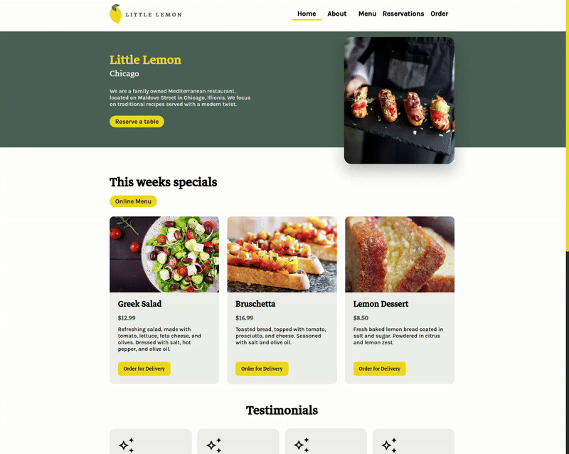

<h1 align="center">Little Lemon Restaurant</h1>

<br />

<p align="center">
    
    
    
    
    
</p>

<h3 align="center">
    <a href="https://little-lemon-coursera-psi.vercel.app/">
        <strong>« See the preview »</strong>
    </a>
</h3>

## Pages

- Home
- About
- Menu
- Reservations
- Order

## Preview



## Quick Start

```sh
git clone https://github.com/KarineBrandelli/little-lemon-coursera.git

cd little-lemon-coursera

yarn
```

### Launch the app

Use the following command to run the app in your localhost.

```sh
yarn start
```
